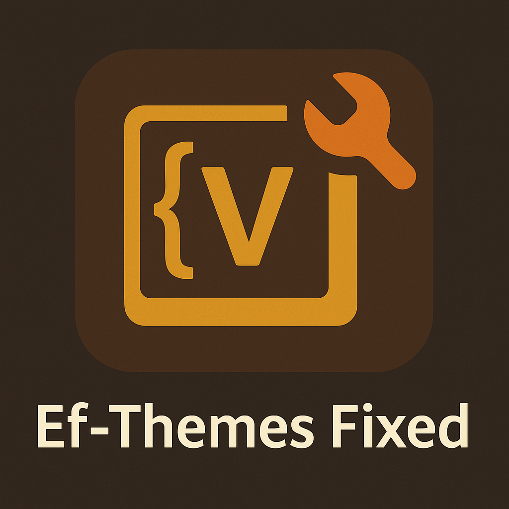

<p align="center">
  
</p>

<h1 align="center">Ef-Themes for VSCode Fixed 🎨🛠️</h1>

<p align="center">
  
</p>

Welcome to a refined and polished collection of Emacs-inspired themes, carefully adapted for Visual Studio Code. This repository contains a fixed, curated version of the [ef-themes-vscode](https://github.com/anhsirk0/ef-themes-vscode) collection. ✨

All original themes are credited to [anhsirk0](https://github.com/anhsirk0) and the creator of the [ef-themes for Emacs](https://protesilaos.com/emacs/ef-themes/). This version enhances the original set by fixing inconsistencies, ensuring modern formatting, and adding several themes that were missing from the original port. 🎯🎨

## 🚀 Installation Guide

Follow these simple steps to install Ef-Themes Fixed and elevate your VSCode experience:

```bash
git clone https://github.com/eziotamburini/ef-themes-vscode-fixed.git ~/.vscode/extensions/ef-themes
```

For OSS or VSCodium users:

```bash
git clone https://github.com/eziotamburini/ef-themes-vscode-fixed.git ~/.vscode-oss/extensions/ef-themes
```

**Note:** You might want to delete the `screenshots/` folder!

Then restart VSCode and enjoy! 🎉 Open the command palette (`Ctrl+Shift+P` or `Cmd+Shift+P`) and search for **"Color Theme"** to try out the new look. 🌈💻

## 🖼️ Theme Previews

Here’s a taste of what’s included:

<p align="center">
  
  
  
</p>


👉 View all the previews [in the `screenshots` branch](https://github.com/eziotamburini/ef-themes-vscode-fixed/tree/screenshots).

🎨 You can also [Visit the official Ef-Themes gallery »](https://protesilaos.com/emacs/ef-themes-pictures/)
.

## ❤️ Credits & Acknowledgment

This project builds upon the meticulous work of two creators:

- The original VSCode port by a passionate contributor ([GitHub link](https://github.com/anhsirk0/ef-themes-vscode)) 🌐
- The Emacs Ef-Themes by a renowned theme designer and philosopher ([Ef-Themes website](https://protesilaos.com/emacs/ef-themes/)) 🎨🧠

While this version offers fixes and improvements, the spirit and beauty of the Ef-Themes come directly from their work. This repo stands on the shoulders of giants. 🙏💡

---

Make your editor serene, readable, and productive with Ef-Themes Fixed. 🌌 Happy coding! 💻✨
